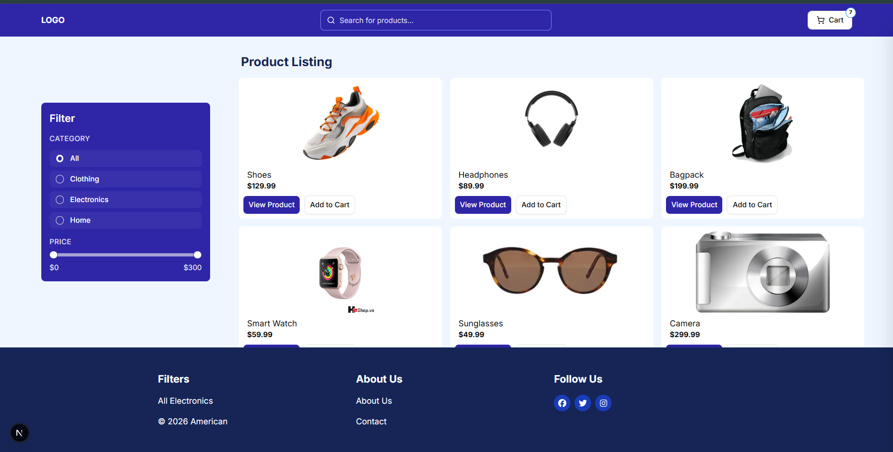
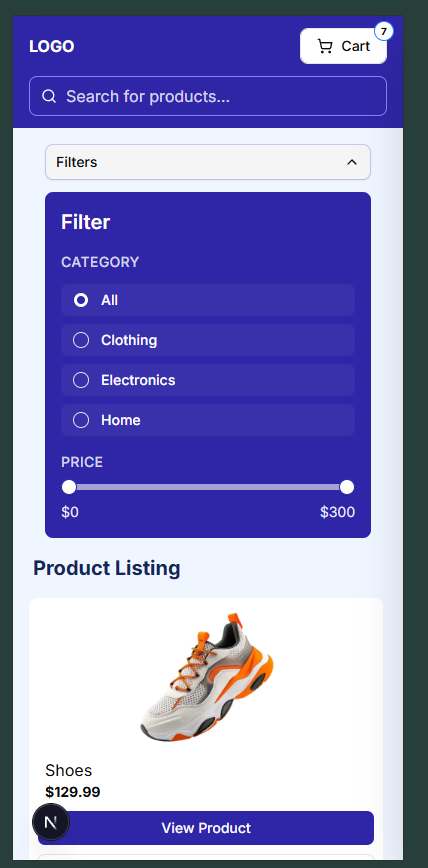
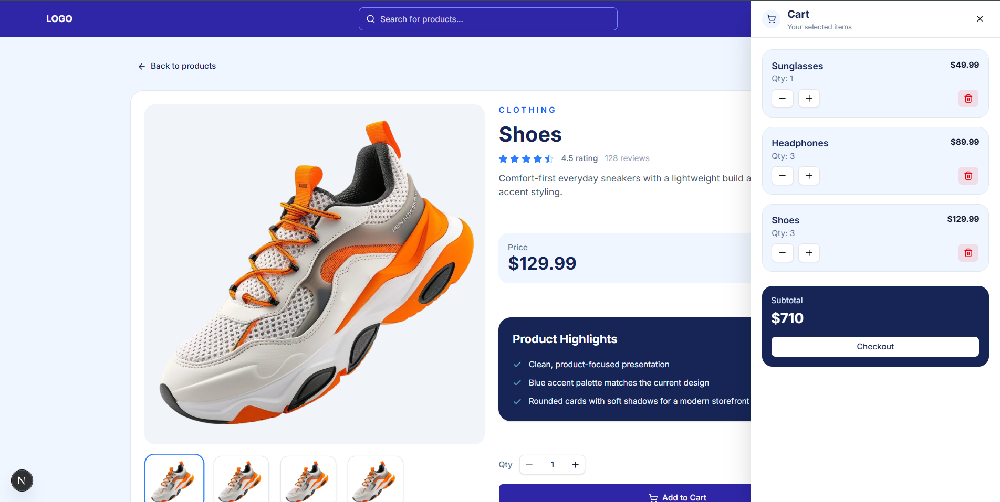
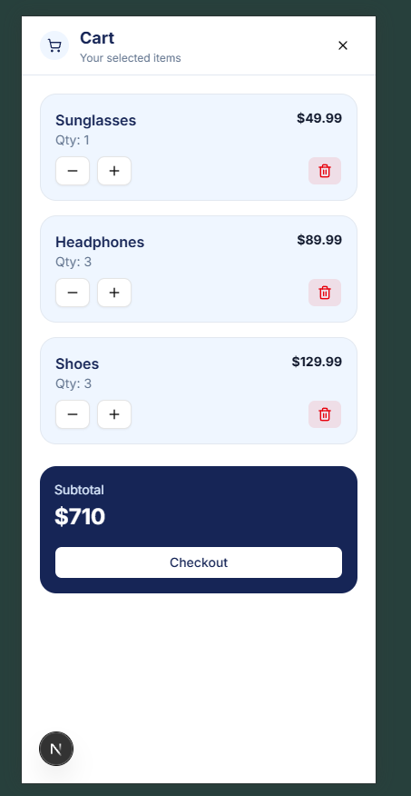

# WhatBytes

A small Next.js storefront with product browsing, filtering, product details, and a cart drawer.

## Go To Website

https://whatbytes-assignment-sand.vercel.app/

## Run Locally

```bash
npm install
npm run dev
```

Open `http://localhost:3000` in your browser.

## Functionalities

- Product listing on the home page
- Category and price filtering
- Search-based filtering
- Responsive home and product pages
- Product detail page
- Cart drawer with add, remove, and quantity controls
- Cart persistence with local storage

## Tech Stack

- Next.js
- React
- TypeScript
- Tailwind CSS
- shadcn/ui
- Zustand

## Screenshots

### Home Page




### Products Page



